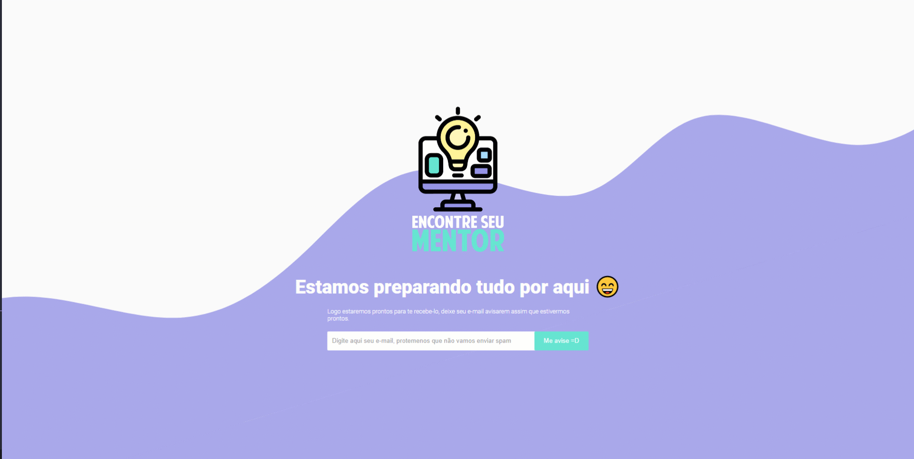

Projeto open source, para ligar aqueles que querem aprender com aqueles que querem ajudar a comunidade compartilhando conhecimento.


## Para rodar o projeto

- Faça o clone do projeto em sua máquina

- Execute o comando ```yarn``` em seu terminal para instalar as dependencias

- Execute o comando ```yarn start ``` para rodar o projeto

### Pronto seu projeto está rodando em http://localhost:3000
